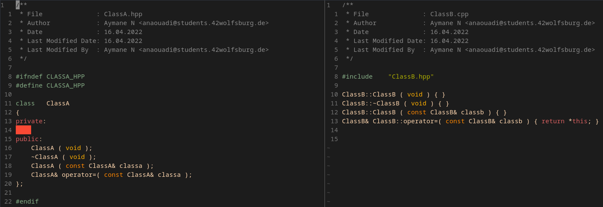

# C++ Class Generator

A Shell script that automate the creation of c++ classes in Orthodox Canonical Form with a Makefile generator.

## Table of contents
* [How to use it ?](#use)
* [What is setup.sh ?](#setup.sh)
* [Examples](#examples)
* [screenshots](#screenshots)

## How to use it ?
Write the names of classes that you want to create in arguments, the script will automatically create for each class two files, one for the header that contains the definition of the class with the .hpp extension. And other one, that contains the implementation of function members with .cpp extension.

`./class.sh	classA classB classC ...`

Also, the script will automatically insert a Header trough the AddHeader command in nvim ( from a plugin ), you can comment the two lines in the script if you are not using it.

To note, the script will always capitalize the name of classes in the creation of files and also in naming them in definitions.

## What is setup.sh ?
`setup.sh` does the same task as `class.sh`, except it adds a Makefile with the specified .cpp files to compile. By calling the script `class.sh` first and then generating the Makefile.

## Examples
The following command `./class.sh	classA classB`, it will create:

* ClassA.cpp
* ClassA.hpp

* ClassB.cpp
* ClassB.hpp

## Screenshots
with classes' definitions and declarations as it's shown in screenshots below:

* ClassA.hpp

* ClassA.cpp

* ClassB.hpp and ClassB.cpp

* Makefile generated by `setup.sh`

